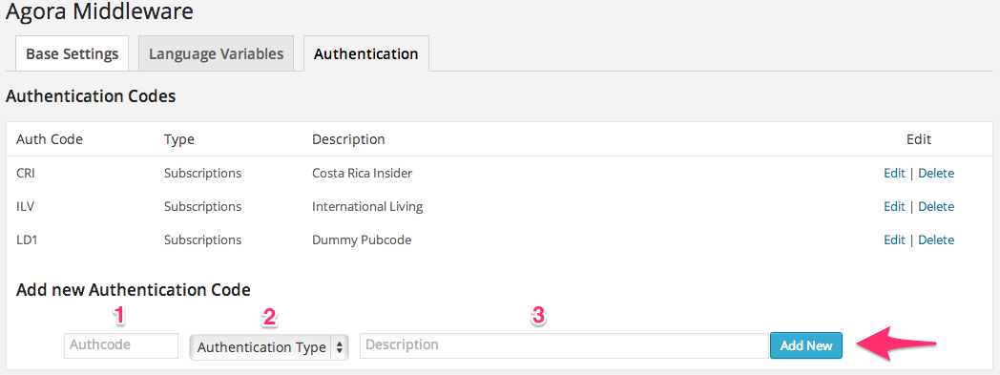
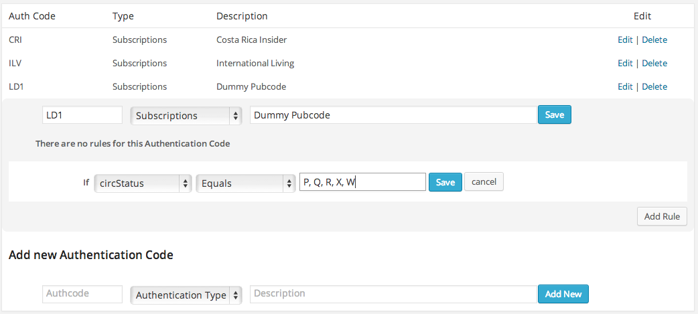
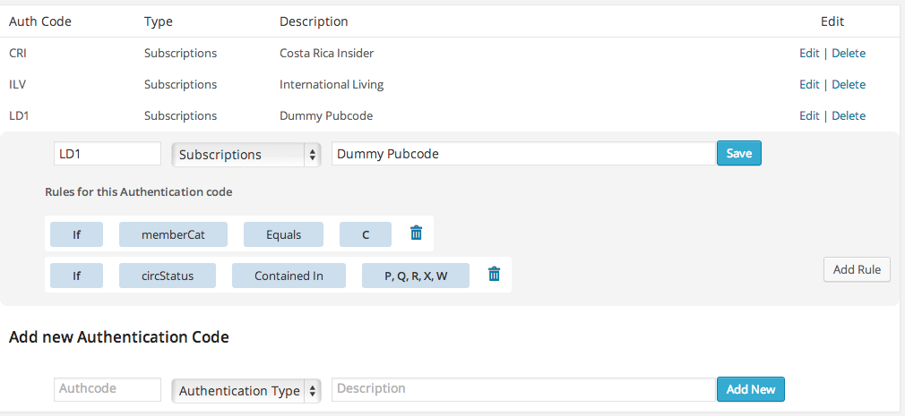
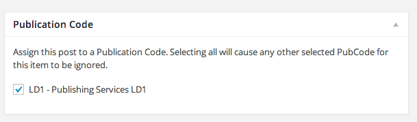

The Auth plugin gives you great flexibility. From simple pubcode authentication to complex rules based on subType, memberCat, memberOrg etc. 

When you enable the plugin you'll see an 'Authentication' menu item in the Wordpress Admin under *Middleware 2*


# Adding Authcodes



Authentication codes are the most basic level of authentication.  An authcode can correspond to a Publication, a Product, or an AccessMaintenanceBilling (AMB) item. Any authcodes defined on this page will appear at the bottom of the edit screen when editing content. It will even appear for custom post types.

For example, say we have a publication with a code of LD1 and we want to password protect content for it. 

1. Enter the pubcode 'ILV'
2. Choose 'Subscriptions' from the drop-down menu
3. Enter a description to help your editors identify the item.

Now if you tag a post with 'LD1', it will be password protected for users with the LD1 publication on their account '''AND''' their circStatus is any of the following: P, Q, R, X, W

Note, as of version 1.1 of the plugin only Subscriptions are supported without additional rules for effective authentication.

## Rules
The rules system allows you to create more complex authentication systems.

Lets say we have a publication and we want to make use of the memberCat field. We can add a new publication for it and attach some rules

1. Enter the pubcode 'LD1'
2. Choose 'Subscriptions' from the drop-down menu
3. Enter a description
4. Click 'Add New'

The authcode will appear on the list.

1. Clicking 'Edit' beside the authcode will show the edit menu.
2. Click 'Add Rule'. This will display a form to create a rule for your authcode



Note, as soon as we add a rule to an authcode, the default check for circStatus is forgotten about so if you want to include that you will need to add a rule for it.



Here we have added two rules to the authcode 'LD1'. Now when a user visits a page that is tagged for LD1, the plugin will check that they have a valid circStatus ''AND'' that their memberCat is equal to 'C'

### Notes about rules

1. Adding any rule will remove the automatic check for circStatus
2. Rules follow '''AND''' logic. If you have multiple rules on an authcode they must all be true for the user to be allowed view the content.

# Password Protecting Content

When editing or creating content you will now see a 'Publication Code' box below the WYSIWYG editor.

'''Note''' You may need to enable this box by going to to the 'Screen Options' pull down menu at the top right of the page, and checking off the Publication Code box.



Simply tick off the pubcode(s) you want to protect your content for. Access works on an 'OR' basis, i.e. a user with ''any'' of the marked pub codes on their account will be granted access.

# Automatic Login from Message Central Mailings Version 1.2.2.2 and above
Changes to MC tags deployed on 5/5/2015 allows for click tracking but forced a change to the plugin.  

Functionality works the same as below but the variables change name:

* a = oid = Org ID
* o = mid = Mailing ID
* u = cid = Contact ID

Affiliates should now be able to use the trackable form of the link

# Automatic Login from Message Central Mailings Version 1.2.0 to 1.2.2.3

The plugin has the ability to automatically log a user in from a MC mailing.  (Version 1.2.0+)
 
This is a great feature for fulfilling paid content. You can provide a link to "view the latest issue" and the user will be brought straight to their content.

Vid, or tokenized login links will only work once. This prevents a user from accidentally giving access to their paid content if they forward an email.

To make it work, simply use MC to append the following variables to a link on your Wordpress site:

* mid - Mailing ID
* cid - Contact ID
* vid - Verification Number
* oid - Org ID

For example use the following tag in MC to generate the appropriate code:

```<a href="http://yoursite.com/your/url?[%= :UnsubParams %]">Click Here to Log in</a>```

Where **yoursite.com/your/url** is the address of the protected page you want to send the user to.

Each vid, or token is unique to that customer, and mailing. Once it has been used, it can never be used again.

# Single Sign On

If you have more than one site and would like users to have the ability to pass from one to the other without having to log in again, this is the feature for you...

Use the single_sign_on_url method on the security class to get a URL with all the necessary variables.

**Note** both sites will need to be running Version 1.2.1 or higher of the Authentication Plugin and 1.0.5 of the Base plugin

Here's an example: 

```php
<?php
	$url =  agora()->security->get_single_sign_on_url('http://moneymorning.com/dashboard', agora()->user->get_customer_number(), 'MMP');
	
	echo "<a href='$url'>Click Here to move to the other site</a>";
?>
```
