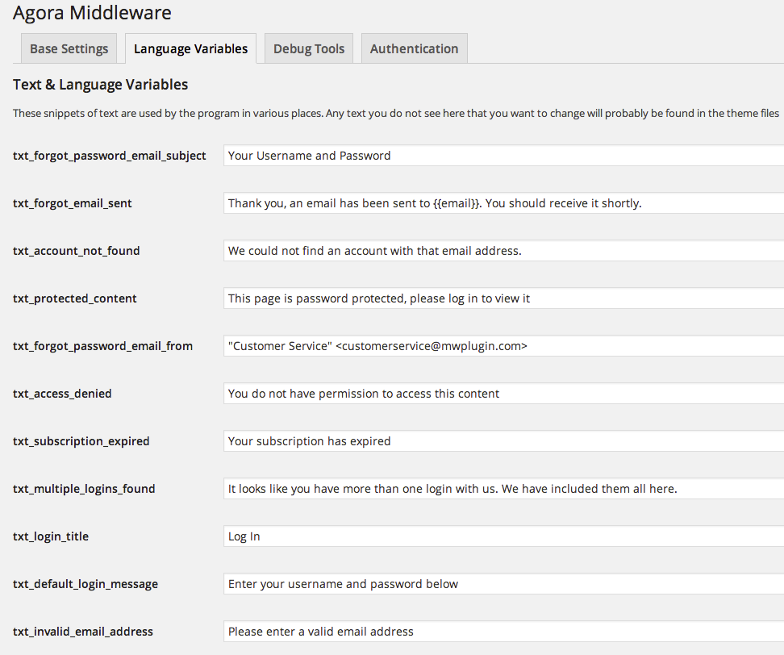

Messages, and phrases that the plugin uses can be edited in through the wordpress admin interface.

Simply go to *Middleware 2* -> *Language and Variables* in the wordpress admin menu.

You'll see a page that looks like this:

Most of these variables are pretty self explanatory, there are just a couple of things to watch out for.

## txt_forgot_password_email_from

This variable tells wordpress what email address to send the password reset messages from.

You can format the email address in the following way:

1. Put the name in quotes, e.g. "Acme Customer Service"
2. Followed by the email address in angle brackets: &lt;info@acme.com&gt;

## inp_forgot_password_email_text

This variable is the content of the lost-password email.

Note the {{link}} tag. This gets replaced with the link to reset the user's password when the email is sent. You can edit the email copy and place this tag wherever you want.

This is replacing the {{login}} tag which was used when the function just sent the details to the customer. If you are updating from an old version of the plugin (before 1.2.4), you may need to replace this tag with {{link}}.

## inp_forgot_username_text

This variable is the content of the forgot-username email.

In version 1.2.4 the plugin added a way of sending just the username to a customer based on their email.

Note the {{login}} tag. This get's replaced with the user's username (or usernames if more than one is associated with the email account). You can edit the copy and place the tag wherever you want.

When you upgrade to 1.2.4 or higher, you may not have the variable showing up automatically. Deactivating and reactivating the plugin should add the variable.
