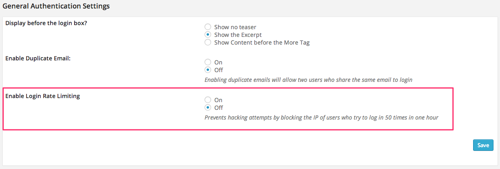

# Security Module

## Rate Limiting 
Rate limiting protects your site from hackers who try to guess the password of users and admin accounts. It also helps middleware run more smoothly by 

The Authentication plugin has the following protections in place

1. When a failed login occurs the plugin will record that failure and the IP it came from
2. If the same IP address fails to log in 50 times in one hour that IP will be blocked from trying to login for 1 hour.
    1. The user will be bounced to an error message telling them why they can't log in. 
3. After the hour has passed, the block will be lifted and that IP address will be allowed to log in again.

You can turn this feature on or off from the Authentication settings tab using the selector here:



This is by no means bullet-proof protection from hackers but it will provide basic protection. If you would like to take stronger measures there are many plugins available that will help. Also consult with a good system administrator for advice.

### Customization
You can customize the error page by hooking into the ```agora_login_security_die``` filter.

# Cleaning Sensitive Data
Middleware returns a **lot** of data about the user, and the plugin stores it in the wp_usermeta table. You might want to prevent the plugin from storing certain sensitive data such as the users password in plaintext.

You can do this using the following code. It's suggested you put this in your functions.php

```php
<?php

// Place in functions.php

function clean_sensitive_data($middleware_data, $username = null, $password = null){
	if(isset($middleware_data->accounts)){
		foreach($middleware_data->accounts as &$a){
			unset($a->password);
		}
	}
	return $middleware_data;
}

add_filter('load_middleware_aggregate_data', 'clean_sensitive_data', 999, 3);

```

Be careful what variables you unset here as some of them may be necessary for authentication to work.